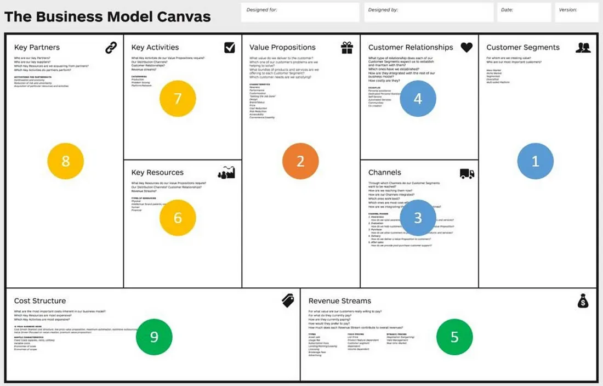

# 📚 Conteúdo da Aula - Aula 2: Ideação e Canvas da Proposta de Valor

### Conceitos Principais

- Processo de concepção e desenvolvimento de produtos em seis etapas.
- Princípios e etapas do Design Thinking como ferramenta de inovação.
- Estrutura do Business Model Canvas, com foco na Proposta de Valor.
- Como transformar ideias em protótipos viáveis e bem direcionados.

---

### Conteúdo Teórico Detalhado

#### Processo de Concepção de um Produto

O processo de evolução de uma ideia para um produto pode parecer algo difícil. Para facilitar isso, existe o processo de desenvolvimento de produtos, dividido em seis etapas que levam um conceito inicial para um lançamento final no mercado. As etapas são:

1. **Concepção da ideia (ideação):**  
Todo produto inicia-se com a geração de novas ideias. Nesse estágio, é importante ter atenção ao cliente e mercado, analisando:
- **Mercado-alvo:** compreender o perfil do consumidor.
- **Outros produtos:** identificar soluções já presentes no mercado que resolvam o mesmo problema e buscar o diferencial.
- **Funcionalidade:** ter uma ideia clara das funções, visual e propósito do produto.
- **Análise SWOT:** mapear forças, fraquezas, oportunidades e ameaças.

Debates em grupo ajudam a trabalhar e refinar a ideia para evitar problemas futuros.

2. **Definição do produto:**  
Depois de entender mercado e funcionalidade, inicia-se a definição do escopo e conceito. Isso envolve:
- **Análise comercial:** estratégias de distribuição e estudo da concorrência.
- **Proposta de valor:** como o produto resolve o problema e o que o diferencia no mercado.
- **Métricas de sucesso:** lucro, taxa de crescimento ou outras métricas personalizadas.
- **Estratégia de marketing:** como divulgar e alcançar o público.

Com isso, a construção do mínimo produto viável (MVP) pode começar.

3. **Prototipagem:**  
A equipe pesquisa e documenta o produto, criando um plano de negócios que inclui:
- **Pesquisa de risco de mercado:** evitar prejuízos no lançamento.
- **Estratégia de desenvolvimento:** divisão de tarefas e cronograma.
- **Análise de viabilidade:** revisar trabalho e prazos, adaptando quando necessário.
- **Mínimo produto viável (MVP):** produto básico com as funções essenciais.

4. **Design inicial:**  
Com o MVP pronto, a equipe desenvolve um modelo de produto com base no público-alvo e nas funções principais. Isso exige:
- **Obtenção de materiais:** fornecidos por terceiros ou pela própria equipe.
- **Interação constante:** comunicação clara para evitar problemas.
- **Feedbacks:** ouvir a opinião da equipe e stakeholders para ajustes.

5. **Validação e testes:**  
Antes de comercializar, é preciso validar o produto:
- Testar funcionalidades com o público-alvo.
- Avaliar marketing e comunicação.
- Incorporar melhorias a partir dos feedbacks.

6. **Comercialização:**  
O lançamento ocorre acompanhado da supervisão e medição de resultados, sempre usando as métricas definidas.

---

**Exemplos práticos:**
- **Figma:** A primeira ferramenta de design de interface para navegador. Evolui continuamente, lançando novas funcionalidades através de ciclos de desenvolvimento estruturados.
- **Uber:** Atendeu uma demanda específica (viagens sob demanda) e foi expandindo com novos serviços (entregas, Uber Black), sempre aplicando processos bem definidos de inovação.

Referência:  
[Asana - Product Development Process](https://asana.com/pt/resources/product-development-process)

---

#### Design Thinking

O Design Thinking é um processo dinâmico e criativo de solução de problemas centrado no ser humano. Ele busca resolver problemas reais através de conversas em equipes multidisciplinares para definir soluções eficazes. Ele foca no usuário, buscando construir algo humano, tecnicamente viável e economicamente sustentável.

---

**Etapas do Design Thinking:**

1. **Empatia:**  
Compreender o cenário do cliente, empresa ou aplicação. Ferramentas como mapas de empatia, entrevistas e benchmarking ajudam a entender o ambiente.

2. **Definição do problema:**  
Depois de mapear o contexto, é preciso escolher e definir claramente o problema a ser resolvido. Essa etapa filtra os dados coletados para direcionar as ações seguintes.

3. **Ideação:**  
Gerar ideias criativas e fora da caixa. A diversidade de perfis na equipe é essencial para expandir a visão. Ferramentas: brainstorming, matriz de posicionamento, cardápio de ideias.

4. **Prototipação:**  
Criar modelos rápidos e baratos para testar hipóteses. Não é necessário incluir todas as funções finais — apenas transmitir a essência e o funcionamento central.

5. **Teste:**  
Validar as ideias e protótipos, entendendo o que funciona, o que precisa melhorar e o que deve ser descartado. Feedbacks reais são cruciais para refinamento.

Referências:  
[IDEO - Design Thinking](https://designthinking.ideo.com/)  
[Etapas do Design Thinking](https://esr.rnp.br/metodos-ageis-e-inovacao/etapas-do-design-thinking)

---

#### Business Model Canvas (com foco ampliado)

O Business Model Canvas é uma ferramenta visual criada para ajudar empreendedores e equipes a entenderem e desenharem modelos de negócio de forma simples e objetiva. Ele é dividido em **9 blocos essenciais**, que, quando preenchidos, dão uma visão completa de como a empresa cria, entrega e captura valor.

---

1. **Proposta de Valor**  
É o coração do canvas. Define **o que você oferece** que resolve um problema ou satisfaz uma necessidade específica do cliente.
- Quais benefícios estamos entregando?
- Qual problema estamos resolvendo?
- Por que o cliente deve nos escolher e não o concorrente?

Exemplos:  
- Entrega rápida (Amazon Prime)  
- Experiência personalizada (Spotify)  
- Preço acessível (Rappi Prime)

---

2. **Segmentos de Clientes**  
Quem são os clientes ou usuários finais do produto/serviço?  
- Para quem estamos criando valor?
- Quais são nossos segmentos prioritários?

Exemplos:  
- Usuários jovens em redes sociais (TikTok)  
- Pequenas empresas que precisam de logística (Loggi)  
- Estudantes universitários em busca de material didático (Estante Virtual)

---

3. **Canais**  
Como o produto chega até o cliente? São os meios usados para comunicação, entrega e venda.
- Como os clientes preferem ser alcançados?
- Quais canais funcionam melhor?

Exemplos:  
- Lojas online (e-commerce)  
- Aplicativos mobile  
- Atendimento direto via WhatsApp

---

4. **Relacionamento com Clientes**  
Que tipo de relacionamento estabelecemos com os clientes?
- Atendimento pessoal ou automático?
- Comunidades, autoatendimento, suporte técnico?

Exemplos:  
- Suporte personalizado (empresas de software B2B)  
- Autoatendimento online (Netflix)  
- Comunidades online (Reddit, fóruns)

---

5. **Fontes de Receita**  
Como a empresa gera receita?
- O que os clientes estão dispostos a pagar?
- Como preferem pagar?

Exemplos:  
- Venda direta (lojas)  
- Assinaturas mensais (Spotify, Netflix)  
- Publicidade (Google, Facebook)

---

6. **Recursos-Chave**  
Quais são os ativos necessários para fazer o modelo de negócios funcionar?
- Recursos físicos, intelectuais, humanos ou financeiros?

Exemplos:  
- Equipe técnica (desenvolvedores)  
- Plataforma digital  
- Marca reconhecida

---

7. **Atividades-Chave**  
O que a empresa precisa fazer para entregar sua proposta de valor?
- Desenvolvimento de produto?
- Marketing?
- Logística?

Exemplos:  
- Criar e manter a plataforma digital (Uber)  
- Produzir conteúdo original (Netflix)  
- Gerenciar estoque e distribuição (Mercado Livre)

---

8. **Parcerias Principais**  
Quem são os parceiros e fornecedores mais importantes?
- Quem ajuda a empresa a funcionar?

Exemplos:  
- Restaurantes parceiros (iFood)  
- Motoristas parceiros (Uber, 99)  
- Plataformas de pagamento (PayPal, Stripe)

---

9. **Estrutura de Custos**  
Quais são os custos mais importantes para operar o modelo?
- Custos fixos (salários, aluguel)?
- Custos variáveis (comissões, marketing)?

Exemplos:  
- Manutenção de servidores e infraestrutura tecnológica  
- Campanhas publicitárias  
- Comissões pagas a parceiros

---

### Resumo visual do Business Model Canvas

### Exemplos e Demonstrações

| Exemplo          | Descrição                                                                           | Link/Arquivo                              |
|------------------|-------------------------------------------------------------------------------------|------------------------------------------|
| Exemplo 1        | Processo no Figma para adicionar funcionalidades                                    | [Asana - Product Development Process](https://asana.com/pt/resources/product-development-process) |
| Exemplo 2        | Como a Uber utilizou inovação para superar o mercado tradicional                    | [Asana - Product Development Process](https://asana.com/pt/resources/product-development-process) |
| Exemplo 3        | Preenchimento prático da Proposta de Valor no Business Model Canvas                | [Medium - Canvas](https://medium.com/coproduto/tudo-sobre-business-model-canvas-31a3daac44f8)    |

---

### Recursos e Materiais de Apoio

- Slide da aula: [Inserir link ou nome do arquivo]  
- Template Business Model Canvas: [Inserir link ou arquivo digital]  
- Documento resumo das etapas do Design Thinking: [Inserir link ou arquivo PDF]  
- Material de apoio para monitores: [Inserir link ou roteiro]

---

### Ponto de Atenção

- **Dificuldades Comuns:**
  - Alunos podem achar confuso como aplicar Proposta de Valor a ideias iniciais.
  - Grupos podem querer preencher todos os blocos do canvas de uma vez, perdendo o foco.
  - Possível desnível entre os que entendem os conceitos rapidamente e os que ficam para trás.

- **Soluções/Planos Alternativos:**
  - Guiar os grupos focando apenas nos blocos específicos designados.
  - Fornecer exemplos claros antes de iniciar a prática.
  - Garantir que os monitores façam rodadas entre os grupos para identificar e ajudar alunos com dificuldade.
